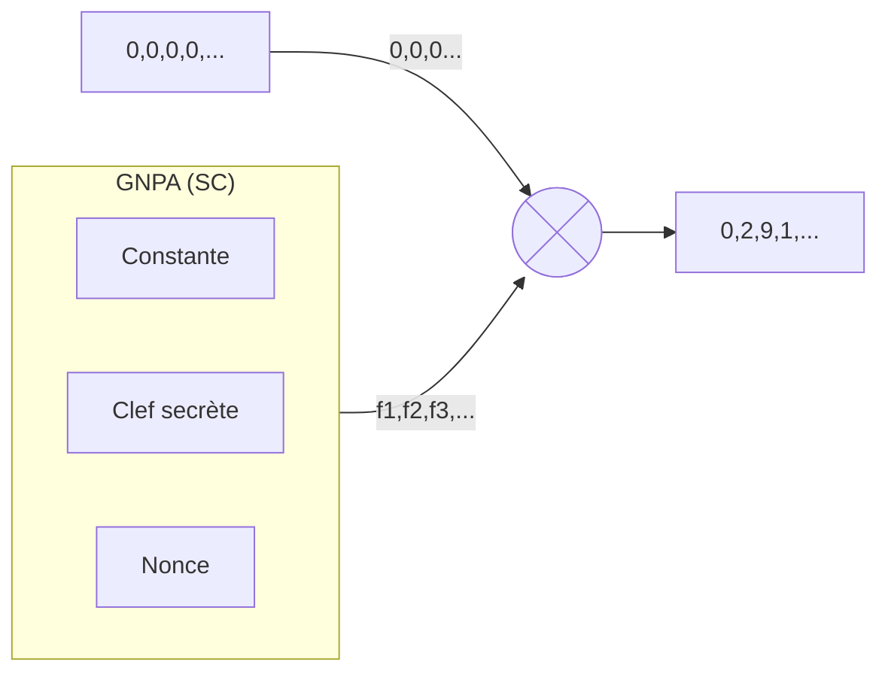

# Projet Fog
## Objectif

## Pré-requis

## Fonctionnement
### 1. Chiffrement
1.1 Définir le dossier de banque d'images
1.2 Créér un GNPA pour ordonner les images 
1.3 Définir l'ordre des images à l'aide du GNPA
1.4 Définir l'en-tête du protocole
1.5 Créer un GNPA de distribution de position
1.6 Distribuer l'en-tête
1.7 Distribuer le contenu du fichier bite par bit

### 2. Déchiffrement
2.1 Définir le dossier de banque d'images
2.2 Créér un GNPA pour ordonner les images 
2.3 Définir l'ordre des images à l'aide du GNPA
2.4 Créer un GNPA de distribution de position
2.5 Obtenir les informations de l'en-tête
2.6 Obtenir le contenu du fichier en binaire
2.7 Réassemblage du fichier et ajout de l'extension

## Annexe : Fonctionnement XChacha20
Here is a simple flow chart:

