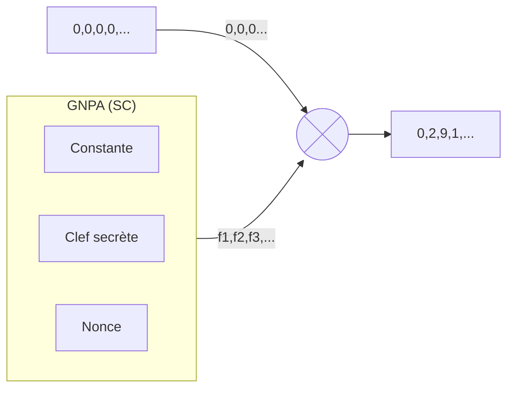

# Projet Fog
## Objectif
L'objectif du projet Fog est de dissimuler de manière pseudo sécurisée un fichier quel qu'il soit dans une banque d'images. 
Les images pourront ensuites être transmise via divers canaux de communication et une fois toutes les images receptionnée, le destinataire peut déchiffrer ces dernières.
Le programme utilisera un algorithme de chiffrement symétrique pour obtenir ces resultats.

## Pré-requis
### Définition
**GNPA (SC):** 
Générateur de nombre pseudo-aléatoire (Sécurisé Cryptographiquement).

## Fonctionnement
### 1. Chiffrement
1. Définir le dossier de banque d'images
2. Créér un GNPA pour ordonner les images 
3. Définir l'ordre des images à l'aide du GNPA
4. Définir l'en-tête du protocole
5. Créer un GNPA de distribution de position
6. Distribuer l'en-tête
7. Distribuer le contenu du fichier bit par bit

### 2. Déchiffrement
1. Définir le dossier de banque d'images
2. Créér un GNPA pour ordonner les images 
3. Définir l'ordre des images à l'aide du GNPA
4. Créer un GNPA de distribution de position
5. Obtenir les informations de l'en-tête
6. Obtenir le contenu du fichier en binaire
7. Réassemblage du fichier et ajout de l'extension

## Annexe : Fonctionnement XChacha20
Here is a simple flow chart:

