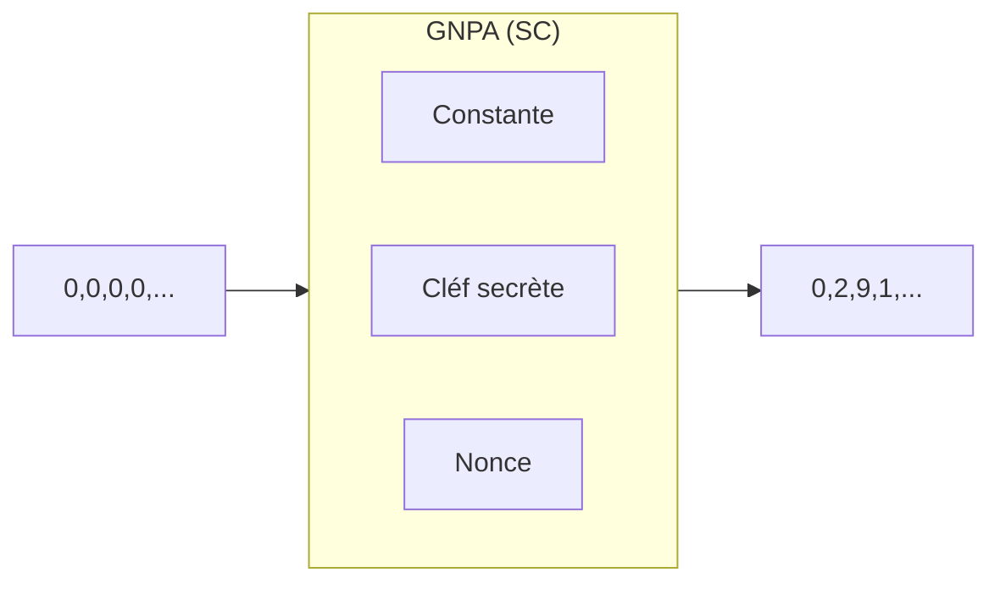

# Projet Fog

Here is a simple flow chart:

```mermaid
flowchart LR;
 subgraph s1["GNPA (SC)"];
    direction LR;
        n3["Constante"];
        n1["Cléf secrète"];
        n2["Nonce"];
        
  end;
    A["0,0,0,0,..."] --> s1;
    s1 --> B["0,2,9,1,..."];
```